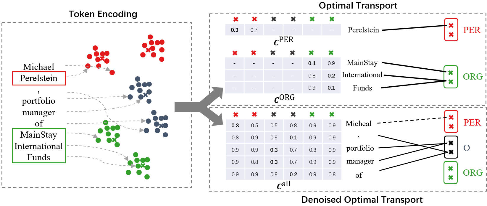

# MProto

Source codes for the paper "MProto: Multi-Prototype Network with Denoised Optimal Transport for Distantly Supervised Named Entity Recognition", accepted to EMNLP 2023.

## Overview



The overview of MProto. For the clarity, we only show tokens of three classes (*PER*, *ORG* and *O*) and MProto with two prototypes per class. MProto is a prototype-based classifier where predictions are made based on the similarity between token features and prototypes. To optimize the multiple-prototype classifier, we assign each token an appropriate ground-truth prototype. The top right of the figure illustrates the token-prototype assignment for entity tokens which is considered as an OT problem. The bottom right of the figure illustrates the token-prototype assignment for *O* tokens which is solved by our DOT algorithm where *O* tokens assigned with non-*O* prototypes (in dashed line) are considered as label noise. The assignment is done based on cost matrix (the tables shown in the figure) where each cell is the distance between a token and a prototype.

## Usage

### Environment setup and preparation

```bash
conda create --name mproto --file requirements.txt
```

First download pre-trained language model (from huggingface) and
set `plm_path` and `tokenizer_path` in the configuration file to the path of the pre-trained language model.

We use bert-base-cased for CoNLL03 dataset and biobert-base-cased-v1.1 for BC5CDR datset.

### Train and test

We train our model using RTX-3090 on all datasets.

Type the following command to train and test the model.

```bash
python -m scripts.train_and_test cfg/conll03-dict/mproto/train-p3-1.0.toml
```

## Dataset

We provide distantly-annotatetd datasets of CoNLL03 and BC5CDR in `data` directory.

The dataset is the same as [Zhou et al.](https://github.com/kangISU/Conf-MPU-DS-NER) but in different format.

## Citation

TODO
